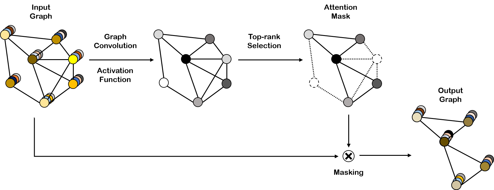

Pytorch implementation of Self-Attention Graph Pooling
====

PyTorch implementation of [Self-Attention Graph Pooling](https://arxiv.org/abs/1904.08082)




## Requirements

  * torch_geometric
  * torch

## Usage

```python main.py```


## Cite
```
@InProceedings{pmlr-v97-lee19c,
  title = 	 {Self-Attention Graph Pooling},
  author = 	 {Lee, Junhyun and Lee, Inyeop and Kang, Jaewoo},
  booktitle = 	 {Proceedings of the 36th International Conference on Machine Learning},
  year = 	 {2019},
  month = 	 {09--15 Jun}
}
```